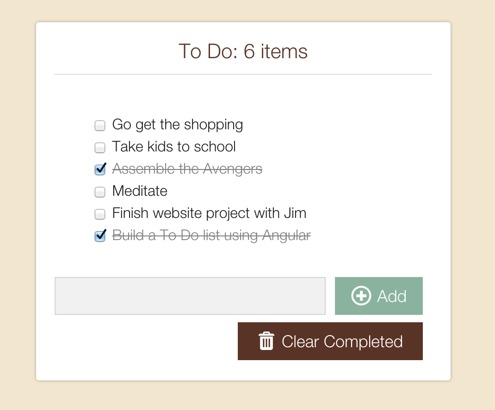

To Do
=====

A simple To Do list application built using AngularJS, HTML and CSS.

A working version of the application can be found [here.](http://angular-to-do-list.herokuapp.com/)

The list title displays the number of items remaining to be completed on the To Do list. This number also dynamically updates as you use it (thanks to Angular's data-binding).

You can add as many tasks as you want and can also clear tasks that have been checked off.